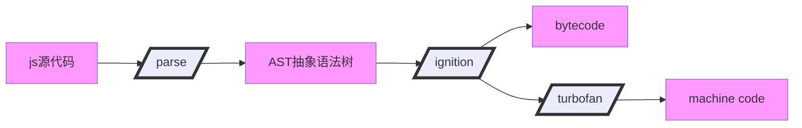

1.  因为计算机是不能直接识别 JS 这种高级语言的，只能识别机器语言，所以需要 JS 引擎来将其翻译成机器语言。
2.  JS 引擎对 JS 代码的处理包括解析和执行两个阶段。JS 代码的解析和执行并不是一次性完成的，而是交替进行的；当 JS 引擎执行代码时，它可能需要解析新的代码；反之，当它在解析阶段时，也可能会执行一些代码。
3.  比较著名的 JS 引擎有：Google 谷歌的 V8（应用在 Chrome 浏览器 和 Node.js 上）、Mozilla 的 SpiderMonkey、Apple 苹果的 JavaScriptCore、Microsoft 微软的 Chakra。
4.  由于现在 JS 是可以在浏览器外使用的，因此 JS 引擎可以独立于浏览器单独使用。
5.  JS 引擎解析 JS 代码的过程（以 V8 引擎为例）

- Parse：解析器。对 JS 代码进行解析，转换成 AST 抽象语法树。
- Ignition：解释器。根据 AST 抽象语法树生成字节码，并逐行一边解释一边执行字节码；同时会收集 TurboFan 优化所需要的信息（比如：函数参数的类型信息，有了类型才能进行真实的运算）。
- TurboFan：编译器。如果一段代码被重复执行，那么 TurboFan 会把这段代码的字节码编译为 CPU 可以直接执行的机器码，当再次执行这段代码的时候，直接执行编译后的机器码就可以了，大大提高了代码的执行效率。
- Deoptimization：如果执行重复代码的过程中，发现它发生了变化，之前优化的机器码不能正确地处理运算，就会 Deoptimization 反优化，逆向地将机器码还原为字节码。
  6.V8 引擎中最核心的四个模块，Parse 解析器、Ignition 解释器、TurboFan 编译器、垃圾回收器。

### 参考资料

- https://github.com/estree/estree
* https://blog.csdn.net/wsln_123456/article/details/129334101 浏览器的 JS 引擎
* https://qborfy.com/lowcode/sandbox.html 低代码系列——js沙箱设计
* https://juejin.cn/post/7339401794147500043 跨端轻量JavaScript引擎的实现与探索
